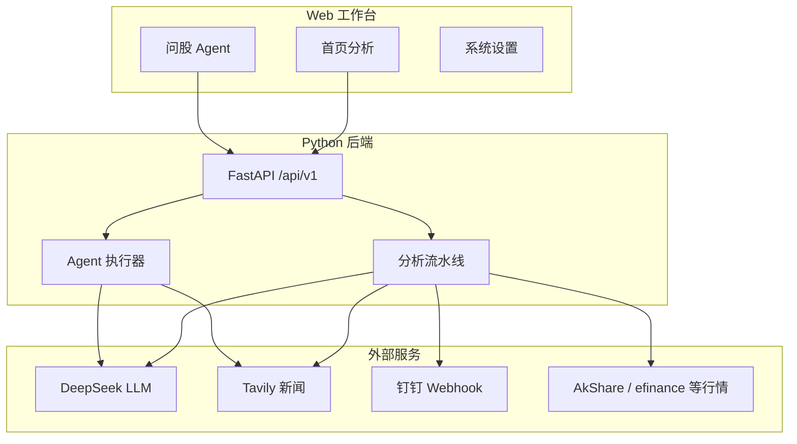

> 本文记录我在 Windows 本机部署 [ZhuLinsen/daily_stock_analysis](https://github.com/ZhuLinsen/daily_stock_analysis) 的完整过程。项目为开源股票智能分析系统，支持 A/H/美股、Web 问股、决策仪表盘与多渠道推送；文中 API Key 均以占位符展示，请勿在公开仓库或博客评论中粘贴真实密钥。

## 背景：为什么选这个项目

日常需要跟踪自选股，但手动刷行情、搜新闻、写结论成本高。`daily_stock_analysis`（下称 DSA）把这几件事串成一条链路：

1. 多数据源拉取行情、K 线、技术指标  
2. 新闻搜索 API 补充舆情与事件  
3. LLM 生成「决策仪表盘」（结论、评分、风险、催化）  
4. 可选推送到钉钉 / 飞书 / 邮件等  

官方支持 **GitHub Actions 零服务器部署** 与 **本地 / Docker 部署**。我需要在 Windows 上交互使用 Web 界面和「问股」，因此选择 **本地运行 + WebUI**。

## 部署方式对比

| 方式 | 适用场景 | 本实践选择 |
|------|----------|------------|
| GitHub Actions | 定时分析 + 推送，无需本机常开 | 未采用 |
| Docker | 服务器长期运行 | 本机未装 Docker |
| **本地 Python** | Web 工作台、手动分析、问股 | ✅ 采用 |

本地目录：`E:\stock\daily_stock_analysis`。

## 环境准备

### 1. 克隆代码

GitHub 访问不稳定时，可使用 Gitee 镜像同步代码，再 `checkout main`。

### 2. Python 版本

项目要求 **Python 3.10+**。本机原仅有 3.9，通过 winget 安装 3.12 后创建虚拟环境：

```powershell
cd E:\stock\daily_stock_analysis
py -3.12 -m venv .venv
.\.venv\Scripts\pip install -r requirements.txt
```

### 3. 前端构建

首次启动 WebUI 时，项目会自动在 `apps/dsa-web` 执行 `npm install && npm run build`，产物输出到 `static/`。本机已安装 Node.js 即可，无需手动构建。

### 4. 启动服务

```powershell
.\.venv\Scripts\python.exe main.py --webui-only --host 127.0.0.1 --port 8000
```

浏览器访问 `http://127.0.0.1:8000`。

## 整体架构（本地 Web 模式）



## 核心配置：`.env`

复制 `.env.example` 为 `.env`，以下三类 Key **相互独立**，需分别申请。

### 1. LLM API（DeepSeek）

用于生成分析报告与问股回复。采用 OpenAI 兼容接口：

```env
OPENAI_API_KEY=sk-你的DeepSeek密钥
OPENAI_BASE_URL=https://api.deepseek.com/v1
OPENAI_MODEL=deepseek-chat
LITELLM_MODEL=openai/deepseek-chat
```

**踩坑：** 若返回 `Insufficient Balance`，说明 DeepSeek 账户余额不足，需在 [DeepSeek 开放平台](https://platform.deepseek.com) 充值；此时页面会显示「暂无分析结论 / 观望 / 未知」等兜底结果，并非行情拉取失败。

### 2. 新闻搜索 API（Tavily）

LLM 只负责「写报告」，新闻由搜索 API 提供素材。A 股场景推荐 [Tavily](https://tavily.com/)（Researcher 计划约 1000 credits/月）：

```env
TAVILY_API_KEYS=tvly-dev-你的Tavily密钥
NEWS_MAX_AGE_DAYS=3
```

每只 A 股分析约触发 **最多 5 次** Tavily 搜索（多维度：最新消息、风险、业绩等）。Agent 模式下可能额外消耗。

**踩坑：** `.env` 中若仍为 `your_tavily_key_here` 占位符，日志会出现 `Unauthorized` 或 `返回 0 条`，报告缺少舆情段落。

可选增强： [博查 Bocha](https://open.bocha.cn/)（`BOCHA_API_KEYS`，中文优化，需在 `.env` 配置，Web 设置页可能无此项）。

### 3. 钉钉群机器人推送

企业微信群机器人用 `WECHAT_WEBHOOK_URL`；**钉钉**走自定义 Webhook：

1. 钉钉群 → **群设置 → 智能群助手 → 添加机器人 → 自定义**  
2. 安全设置建议关键词：`股票` 或 `分析`  
3. 复制 Webhook 地址  

```env
CUSTOM_WEBHOOK_URLS=https://oapi.dingtalk.com/robot/send?access_token=你的token
```

分析完成后，决策仪表盘会自动 POST 到群内。可与 LLM、新闻 Key 同时启用，互不影响。

### 4. 问股功能（Agent 模式）

Web「问股」页需显式开启：

```env
AGENT_MODE=true
AGENT_SKILLS=bull_trend,ma_golden_cross,volume_breakout,shrink_pullback
```

**踩坑：** 未开启时接口返回 **HTTP 400**（`Agent mode is not enabled`）。修改 `.env` 后必须 **重启服务** 才生效。

### 5. 自选股

```env
STOCK_LIST=600519,300750,002594
```

## 配置项与 API 用量关系

| 能力 | 主要消耗 | 粗略用量（单只股票） |
|------|----------|---------------------|
| 首页分析（Agent 开） | DeepSeek 多轮 + Tavily | LLM 多轮；新闻 1～5+ 次 |
| 首页分析（Agent 关） | DeepSeek 单次 + Tavily | LLM 1 次；Tavily ~5 次 |
| 问股 | DeepSeek Agent 多轮 | 按对话轮次 |
| 钉钉推送 | 无第三方 AI 费用 | 仅 HTTP 通知 |

**结论：** 一次分析多只股票 **不会** 比逐只分析更省 API，总量约等于「只数 × 单只成本」。想省钱可关闭首页 Agent（`AGENT_MODE=false` 且清空 `AGENT_SKILLS`），仅保留问股场景再开 Agent。

## 运维与常见问题

| 现象 | 原因 | 处理 |
|------|------|------|
| 端口 8000 被占用 | 旧进程未退出 | `netstat -ano \| findstr :8000` 后 `taskkill` |
| Cursor 无法打开 `.env` | gitignore 隐藏文件 | `notepad .env` 或 Web 系统设置 |
| 有行情无 AI 结论 | LLM 余额或 Key 错误 | 检查 DeepSeek 余额与 `OPENAI_*` |
| 问股 HTTP 400 | Agent 未启用 | `AGENT_MODE=true` 并重启 |
| 新闻为空 | Tavily Key 无效 | 替换真实 Key，看日志 `返回 N 条结果` |

日志目录：`logs/stock_analysis_YYYYMMDD.log`。

## 收获与可复用经验

1. **三类 Key 分工清晰**：LLM 写结论、搜索 API 供素材、Webhook 做通知，缺任一环节都会表现为「半套报告」。  
2. **开源项目本地部署**：Python venv + 自动前端构建 + FastAPI，适合个人工作站场景。  
3. **Agent 与批量分析解耦**：问股需要 Agent；日常仪表盘可关 Agent 控制成本。  
4. **密钥安全**：Webhook 与 API Key 不要提交 Git、不要贴在博客或聊天里；泄露后应在平台轮换。

## 相关链接

- 开源仓库：[ZhuLinsen/daily_stock_analysis](https://github.com/ZhuLinsen/daily_stock_analysis)  
- DeepSeek：[platform.deepseek.com](https://platform.deepseek.com)  
- Tavily：[app.tavily.com](https://app.tavily.com/)  
- 完整配置说明：项目内 [docs/full-guide.md](https://github.com/ZhuLinsen/daily_stock_analysis/blob/main/docs/full-guide.md)

---

*部署环境：Windows 10/11 · Python 3.12 · Node.js 22 · 本地 WebUI `127.0.0.1:8000`*
