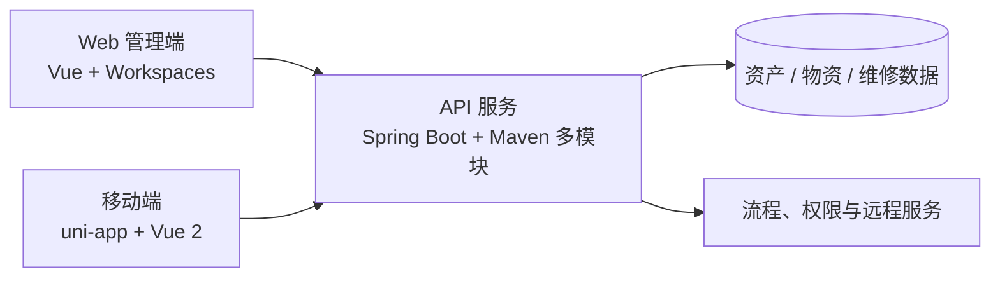

> EAM 是内部企业系统，本文不展示业务数据、接口地址和内部代码，只复盘可公开的技术思路。文中工作依据近期个人提交整理。

EAM 的日常迭代常常跨越三个工程：Web 端负责流程与交互，API 负责业务规则和数据一致性，App 承担现场检修与移动审批。一次看似简单的需求，往往需要三端共同保证“看得见、点得动、提交正确”。

## 功能复盘目录

- 物资与编码：[分类回显时序](/posts/2026/08/eam-material-category-async-loading/) · [盘点防重复提交](/posts/2026/08/eam-inventory-submit-guard/) · [多保管员权限](/posts/2026/08/eam-inventory-multiple-keepers/)
- 外委维修：[动作级校验](/posts/2026/08/eam-outsourced-repair-action-validation/) · [取消后重提预算](/posts/2026/08/eam-outsourced-repair-reapply-budget/)
- 设备与计划：[设备台账科室查询](/posts/2026/08/eam-device-ledger-department-query/) · [需求计划空值安全](/posts/2026/08/eam-demand-plan-null-safety/)
- 移动端：[计划检修人员与工时](/posts/2026/08/eam-app-planned-maintenance-man-hour/) · [登录错误反馈](/posts/2026/08/eam-app-login-error-message/)

## 工程结构

- **Web**：以 workspace 拆分框架和业务包，承载台账、物资、维修、审批等后台页面。
- **API**：Maven 多模块组织网关、认证、任务及各业务域服务。
- **App**：uni-app 工程，覆盖现场点检、计划检修和移动审批等场景。

## 物资盘点：按钮权限之外还有业务权限

近期盘点任务遇到两个典型边界：重复提交，以及一个仓库存在多个保管员时，符合条件的用户没有操作入口。

前者不能只靠提交后禁用按钮。按钮防抖可以改善体验，但可靠方案还应包含：

1. 页面提交中状态立即锁定；
2. 请求完成前禁止再次触发；
3. 服务端根据任务状态拒绝重复处理；
4. 成功后刷新任务状态，而不是继续沿用页面旧数据。

后者说明权限判断不能把“一对多”关系写成单值比较。仓库与保管员是集合关系，页面操作权应由当前用户是否属于有效保管员集合决定。

## 编码修改：先准备基础数据，再回显表单

编码修改申请曾出现分类为空的问题。根因并不是分类不存在，而是分类列表与申请详情并行加载，回显发生时选项尚未准备好。

这类异步表单可采用明确的加载顺序：先获取字典或分类树，再加载详情并完成映射，最后开放编辑。若必须并行请求，则在两者都完成后统一执行一次回显。关键是避免多个 watcher 各自修改同一字段，造成结果依赖网络返回顺序。

物资编码库中的状态修改还增加了入口限制。对于主数据，前端隐藏或禁用按钮是必要的操作引导，但最终约束仍应落到 API 的状态机和权限校验中。

## 外委维修：校验要覆盖流程动作

外委维修的验收、取消和重新申请分别暴露出三个问题：

- 验收审批未选择明细仍能提交；
- 取消未选择明细仍能提交，且可以重复取消；
- 取消后重新申请仍受历史预算状态影响。

表单校验通常只关注字段是否必填，但流程页面还要校验**动作前置条件**。同一个页面执行“保存”“提交”“驳回”“取消”时，需要的字段和明细可能完全不同。因此更合适的做法是按动作组织校验规则，再由后端对当前流程状态进行第二次确认。

历史状态问题则需要区分“新申请的数据快照”和“上一轮流程的结果”。重新申请不应直接复用已经失效的审批状态，必要时应在领域层显式重置或重新计算。

## 设备台账：一个查询条件也是端到端功能

信息化设备台账新增按科室名称查询，看起来只是多一个输入框，实际至少涉及：

- Web 查询表单与参数类型；
- API 查询对象与接口传参；
- Service / Mapper 的查询条件；
- 空字符串、模糊匹配和分页条件；
- 查询权限与组织范围。

只有前端出现输入框不算完成。企业后台中的筛选项需要沿整条调用链核对，尤其要避免新增条件改变原有分页总数或权限过滤逻辑。

## 移动检修：优先保证现场可完成

计划检修移动端近期修复了成本中心、人员选择和实际工时计算。移动场景的特点是输入时间短、网络环境不稳定、用户不方便反复返回修改，所以应优先保证：

- 选择组件回显的 ID 与名称一致；
- 开始、结束时间变化后工时可重新计算；
- 接口失败保留用户已填内容；
- 错误提示包含可采取的下一步，而不是只显示“系统异常”。

登录异常提示由空信息改为展示具体错误，也是同一原则：错误反馈不是装饰，而是现场问题能否被快速定位的一部分。

## API 空值安全：可选数据不要按必填处理

需求计划校验中，子类数据并非所有场景都有值。如果校验逻辑直接访问子类属性，就会在非量检具场景触发空指针。

修复空指针不应只是在报错行前加一个判断，还要先确认业务含义：数据为空时是跳过该类校验、返回明确错误，还是使用默认规则。只有定义了空值语义，防御式代码才不会掩盖真实的数据问题。

## 我的交付检查表

这批迭代后，我把 EAM 常见改动归纳成一份简短检查表：

- 表单基础数据和详情回显是否存在时序依赖；
- 保存、提交、审批、取消是否分别校验；
- 是否可能重复点击或重复调用接口；
- 一对多权限关系是否被误写成单值判断；
- 流程回退、取消后重提是否清理旧状态；
- Web、API、App 对字段含义和错误信息是否一致；
- 可选字段为空时，业务规则是否有明确语义。

## 小结

EAM 的稳定性来自三端共同守住边界。前端负责让状态清晰、操作可预期，API 负责确保规则无法被绕过，移动端则要让现场用户在有限条件下顺利完成任务。

这些改动单独看都不大，但它们连接起来，就是资产、物资、维修和检修业务能否可靠闭环。
