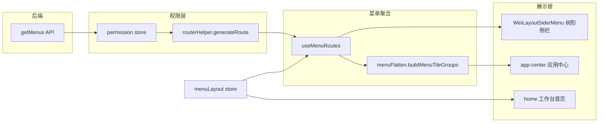

> 本文记录我在雷沃 MES 智造云 Web 端（lovol-mescloud-web）的一次**前端体验升级**实践。项目为内部系统，文中不涉及业务数据与接口细节，截图位请自行替换为打码后的前后对比图。

## 背景：Web 端与桌面 Shell 的同一痛点

这套 MES 云 Web 基于潍柴 **Framework 4.0**（Vue 3 + Vite + Ant Design Vue + Pinia），业务页面由后端菜单管理驱动，登录后通过 `AdminApiSystemAuth.getMenus()` 动态 `addRoute`，`src/views/` 下约 **795 个**业务页面。

与同期重构的 [桌面客户端 Shell](/posts/2026/05/mes-shell-workbench-refactor/) 类似，一线用户反馈集中在：

1. **首屏信息密度低**：登录后进入旧版首页，KPI、待办、快捷入口分散，常用功能要逐级展开侧栏树才能找到。
2. **导航方式单一**：只有左侧树形菜单，跨模块切换路径长；熟悉系统的老师傅够用，新人上手成本高。
3. **个性化不足**：菜单顺序、首页布局无法按岗位偏好保存，每次换机或清缓存都要重新找入口。

目标是：**升级首页工作台与导航体验，同时业务路由与后端菜单配置零侵入**——Web 端和 WPF Shell 共享同一设计原则。

## 改造目标

| 维度 | 目标 |
|------|------|
| 首页 | 模块化工作台：KPI、待办日历、快捷入口、通知公告、今日计划，支持拖拽排序与显隐 |
| 导航 | 支持 **树形（Tree）** 与 **平铺（Tile）** 两种模式，Header 一键切换 |
| 应用中心 | 平铺模式下以磁贴卡片展示各模块入口，保留树形二/三级分组结构 |
| 兼容 | 菜单仍从 `vue-router` 权限路由树读取，不维护第二份 JSON 配置 |
| 个性化 | Pinia + wsCache 按用户持久化菜单模式、首页布局、收藏与排序 |

## 整体架构

核心思路：**不复制菜单，而是从 permission store 的 `routers` 里「读」出动态路由，再映射到侧栏树与应用中心磁贴**。



树形侧栏与应用中心共用同一份 `menuRoutes` 缓存，磁贴点击走 `resolveNavigatePath` 解析后的 vue-router 跳转，**业务页面零感知**。

## 关键实现

### 1. 菜单路由聚合 `useMenuRoutes`

新增 composable，从 `permission store.routers` 构建侧栏菜单树：

- **缓存**：`shallowRef` + `watch` 监听路由树与用户自定义一级菜单排序，避免每次渲染重复遍历
- **首页置顶**：`pinHomeFirst` 保证 `/home` 始终排在菜单首位
- **单叶子提升**：`alwaysShow: false` 的路由（如首页）提升为一级菜单项，与芋道侧栏行为一致
- **同步平铺分组**：`buildMenuTileGroups` 与 `menuRoutes` 同批构建，切换模式时不二次计算

```typescript
// hooks/useMenuRoutes.ts — 核心缓存逻辑
watch(
  () => [appStore.usePermissionStore.routers, layoutStore.topMenuOrder] as const,
  rebuildMenuCache,
  { immediate: true },
)
```

登录后可在空闲时调用 `preloadMenuTileGroups()` 预热，减少首次切到平铺模式的等待。

### 2. 平铺分组 `menuFlatten`

`buildMenuTileGroups` 将顶级路由转为 `MenuTileGroup`：

- 保留树形 **二级/三级** 结构（`subGroups` + `directLeaves`），而非简单扁平列表
- 每个叶子携带 `breadcrumb`、`routeName`，供搜索与跳转
- `resolveNavigatePath` 用已注册路由校验 path，处理动态路由与 name 不一致的边界

应用中心页（`src/views/app-center/index.vue`）直接消费 `useMenuTileGroups()`，支持关键词搜索过滤，展示「共 N 个应用」计数。

### 3. 双模式切换 `HeaderMenuModeSwitch`

顶栏增加树形 / 平铺两个圆形按钮，`menuDisplayMode: 'tree' | 'tile'` 存入 `menuLayout` store：

- 鼠标悬停平铺按钮时 **预加载** 应用中心 chunk + 预热磁贴分组
- 切换平铺 **不再强制跳转** 应用中心（早期版本会 `router.push`，导致整页重渲染卡顿）
- 仅从应用中心切回树形时，若当前路由在 `/app-center`，才 `replace` 回首页

```typescript
// HeaderMenuModeSwitch.vue
async function setMode(mode: MenuDisplayMode) {
  layoutStore.setMenuDisplayMode(mode)
  await nextTick()
  if (mode === 'tree' && isAppCenterRoute(route.path))
    router.replace(HOME_MENU_PATH).catch(() => {})
}
```

平铺模式下 `Main.vue` 隐藏侧栏，顶栏 `MenuTileTopNav` 提供「首页 / 应用」切换。

### 4. 首页工作台模块化

旧版文档描述 `/home/workplace`，现统一为 **`/home` → `home/index.vue`**：

| 模块 ID | 内容 |
|---------|------|
| `kpi` | KPI 指标卡片 |
| `quickRecent` | 待办日历 + 快捷入口 |
| `todoNotice` | 待办任务 + 通知公告 |
| `linePlan` | 今日计划（需选择产线） |

`menuLayout` store 持久化 `homeModuleOrder` 与 `homeModuleHidden`；`migrateHomeModuleOrder()` 兼容旧模块 ID（`actions` → `quickRecent`），并过滤已下线模块（`chart`、`lineQuality`）。

编辑模式下模块可拖拽排序（SortableJS），偏好按 **用户 ID** 写入 wsCache。

### 5. 菜单收藏与布局配置

- **`menuFavorite` store**：收藏常用菜单，本地持久化，侧栏星标一键添加
- **`MenuLayoutSettingsDrawer`**：菜单样式、一级菜单排序、首页模块配置的集中入口
- **侧栏宽度拖拽**：localStorage 记忆，适配不同分辨率

### 6. 与桌面 Shell 的对照

| 维度 | Web（lovol-mescloud-web） | 桌面（mes-client-shell） |
|------|---------------------------|--------------------------|
| 菜单来源 | 后端 API → vue-router 动态路由 | Prism Region 扫描 MenuItem |
| 聚合层 | `useMenuRoutes` + `menuFlatten` | `NavigateMenuCatalog` |
| 状态持久化 | Pinia + wsCache | AppData + 本地配置 |
| 模式切换 | `HeaderMenuModeSwitch` | Shell 顶栏 Tree/Tile 按钮 |
| 业务侵入 | 零（路由仍由后端菜单驱动） | 零（磁贴触发原 MenuItem.Click） |

两套客户端面向同一批制造业务用户，导航体验保持一致，降低「Web 与桌面操作习惯不同」的切换成本。

## 改造前后（示意）

> 请在发布前替换为真实截图，并对产线、工位号等打码。

**改造前**

- 首页模块固定，无法按岗位调整
- 只有左侧树形菜单，跨模块要逐级展开
- 常用功能无收藏，每次从树里找

**改造后**

- 登录默认 landing 到模块化工作台，KPI / 待办 / 计划一屏可见
- 顶栏可切换树形 / 平铺，平铺模式进入应用中心磁贴墙
- 菜单收藏、排序、首页布局按用户持久化

## 踩坑与经验

1. **不要维护两份菜单**  
   早期考虑过 JSON 配置磁贴，很快会被后端权限与动态路由打脸。从 `permission store.routers` 读是唯一数据源。

2. **模式切换别强制跳路由**  
   切到平铺时若 `router.push('/app-center')`，会触发 Main 整页重渲染 + KeepAlive 失效。只改 `menuDisplayMode`、由布局条件渲染侧栏/顶栏，体验顺滑得多。

3. **path 与 name 不一致**  
   芋道动态路由里，菜单 path 与 vue-router 注册 path 有时对不上。`resolveNavigatePath` 用 `router.resolve` + 后缀匹配兜底，避免磁贴点击 404。

4. **旧配置迁移**  
   首页模块改版后，用户 localStorage 里可能存着旧 ID。`migrateHomeModuleOrder` 做映射 + 去重 + 补全默认项，避免升级后首页空白。

5. **Web 与 Shell 统一设计语言**  
   树形/平铺双模式、工作台首屏、模块分组磁贴——与 WPF Shell 重构对齐，方便用户和开发团队形成统一心智模型。

## 小结

这次重构不是「换 UI 皮肤」，而是在 **Vue 3 + 芋道动态路由 MES Web** 里补了一层**个性化导航壳**：

- 用 `useMenuRoutes` + `menuFlatten` 聚合现有权限路由
- 用 `menuLayout` store 连接模式切换、首页布局与用户偏好
- 用应用中心与应用收藏增强跨模块导航效率

对一线用户来说，是「登录就能点常用功能、按习惯排布局」；对开发来说，是「795 个业务页几乎不用改代码」。

---

**技术栈**：Vue 3 · TypeScript · Vite · Ant Design Vue · Pinia · Vue Router · @ice/stark

**关联项目**：[MES · 智造云 Web 前端与菜单重构](/projects/mes-cloud-web/) · [MES · 桌面客户端 Shell 重构](/projects/mes-shell-workbench/)

如果后续允许对外展示，我会在项目页补充演示素材与更完整的架构图。
