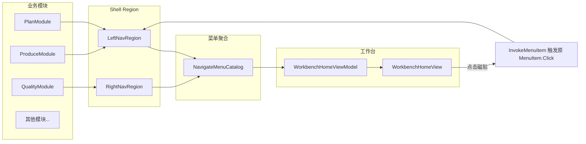

> 本文记录我在制造企业 MES 桌面客户端中的一次**前端壳层重构**实践。项目为内部系统，文中不涉及业务数据与接口细节，截图位请自行替换为打码后的前后对比图。

## 背景：为什么动 Shell

这套 MES 客户端基于 **WPF + Prism + Unity** 搭建，业务按模块拆分（计划、生产、质量、设备、BOM、工艺、打印等），各模块通过 `NavigateItem.xaml` 向 Shell 的 Region 注册树形菜单。

使用一段时间后，一线操作员反馈集中在三点：

1. **首屏信息密度低**：登录后直接进入空白内容区，常用功能要逐级展开侧边栏才能找到。
2. **视觉风格不统一**：Shell 顶栏、Tab、侧边菜单、登录页样式各自为政，像多个时代拼在一起。
3. **导航方式单一**：只有树形菜单，对熟悉系统的老师傅够用，但对新人和跨模块操作不够友好。

目标是：**升级 Shell 与工作台体验，同时尽量不动各业务模块的 ViewModel 与业务逻辑**——这是工业软件重构里最常见的约束。

## 改造目标

| 维度 | 目标 |
|------|------|
| 首屏 | 登录后默认进入「智造执行工作台」，展示欢迎信息、工位/在线人数、按模块分组的快捷入口 |
| 导航 | 支持 **树形（Tree）** 与 **磁贴（Tile）** 两种模式，Header 一键切换 |
| 兼容 | 菜单仍由各模块 `NavigateItem` 声明，不维护第二份菜单配置 |
| 样式 | 抽出 `Workbench.xaml` 主题资源，统一顶栏、Tab、侧边栏、窗口按钮 |
| 范围 | 约 31 个文件，+692 / -497 行（Shell + CommonModule + 各模块导航 XAML） |

## 整体架构

核心思路：**不复制菜单，而是从 Prism Region 里「读」出现有 Menu，再映射到工作台磁贴**。



这样磁贴点击后走的仍是原有 `MenuItem` 的路由与 Command，**业务模块零感知**。

## 关键实现

### 1. 菜单目录服务 `NavigateMenuCatalog`

新增静态服务，扫描 `LeftNavRegion` / `RightNavRegion` 下已注册的视图，递归查找 `Menu` → `MenuItem`，过滤 `Visibility.Collapsed` 的项，聚合成 `MenuModuleGroup` 列表。

几个设计细节：

- **缓存**：首次 Build 后写入 `_cachedGroups`，模块热加载或权限变更时通过 `InvalidateCache()` + 强制刷新重建。
- **去重**：同一模块下相同 Header 的叶子菜单只保留一项。
- **视觉元数据**：为每个入口分配 accent 色板和首字母图标，供磁贴绑定。
- **唤起原逻辑**：不重新 Navigate，而是对源 `MenuItem` 触发 `Click` 事件：

```csharp
public static void InvokeMenuItem(MenuLaunchItem item)
{
    if (item?.SourceMenuItem == null) return;
    item.SourceMenuItem.RaiseEvent(
        new RoutedEventArgs(MenuItem.ClickEvent, item.SourceMenuItem));
}
```

这是整次重构里最省改动、也最稳的一点：**工作台只是现有菜单的另一种呈现**。

### 2. 工作台 ViewModel

`WorkbenchHomeViewModel` 负责：

- 绑定用户信息（问候语、账号、工位、在线人数、服务器 Host）
- 订阅 `MenuCatalogRefreshEvent`，在 Shell 初始化或菜单变更后刷新磁贴
- 订阅 `MenuNavigationModeChangedEvent`，同步 Tree / Tile 模式
- 用 `DispatcherTimer`（250ms）做菜单刷新的防抖，避免 Region 尚未就绪时反复 Build

点击磁贴时先发布 `ShowPageItemEvent` 切到内容区，再在 `ApplicationIdle` 优先级下调用 `InvokeMenuItem`，避免与 Region 切换抢 Dispatcher。

### 3. 双模式导航

定义枚举 `MenuNavigationMode { Tree, Tile }`，状态放在 `AppData.MenuNavigationMode`。

Shell 顶栏增加两个图标按钮；`ShellViewModel.SetMenuNavigationMode` 更新全局状态并发布事件。Tree 模式显示传统侧边栏，Tile 模式隐藏侧栏、默认展示工作台首页。

### 4. 主题资源化

新增 `Workbench.xaml`，集中定义：

- 顶栏渐变背景、强调色线条、HUD 信息面板
- 窗口最小化 / 最大化 / 关闭按钮
- 侧边栏 `WorkbenchSidebarMenu`、Tab `WorkbenchTabControl` / `WorkbenchMenuTab`

各模块 `NavigateItem.xaml` 只需把 `Menu` 的 `Style` 改为 `{StaticResource WorkbenchSidebarMenu}`，即可与 Shell 视觉对齐，**无需逐个控件改模板**。

### 5. 事件总线扩展

在 `MES.Service` 层新增三个轻量事件，解耦 Shell 与 CommonModule：

| 事件 | 用途 |
|------|------|
| `ShellInitializedEvent` | Shell 布局就绪后通知工作台首次拉菜单 |
| `MenuCatalogRefreshEvent` | 权限/模块变化时 invalidate 并刷新磁贴 |
| `MenuNavigationModeChangedEvent` | Tree ↔ Tile 模式同步 |

Prism 的 `EventAggregator` 在这里很合适：Shell 不需要引用 Workbench 的具体类型，只发事件。

## 改造前后（示意）

> 请在发布前替换为真实截图，并对工位号、服务器地址等打码。

**改造前**

- 登录后大面积空白，功能入口藏在侧边栏树里
- 顶栏与内容区风格割裂

**改造后**

- 默认 landing 到工作台：欢迎横幅 + 模块分组磁贴
- 顶栏可切换树形/磁贴，磁贴模式下侧边栏收起，内容区更宽
- Tab、通知区、登录页与 Shell 共用 Workbench 主题

## 踩坑与经验

1. **Region 就绪时序**  
   工作台 `Loaded` 时 Region 里的模块视图可能还没全部注入完。用 `ShellInitializedEvent` + 防抖 Timer 组合，比直接在构造函数里 Build 可靠得多。

2. **不要维护两份菜单**  
   早期曾考虑过 JSON 配置磁贴，很快会被权限与模块动态加载打脸。从 Visual Tree 读 Menu 是「单一数据源」。

3. **样式先资源化再铺模块**  
   先定 `Workbench.xaml` 色板与控件 Style，再批量改各模块 `NavigateItem`，比反过来逐页调色省时间。

4. **工业软件的重构边界**  
   这次刻意没动 Plan/Produce 等业务 ViewModel，只改 Shell、CommonModule 导航壳和 XAML 样式。上线风险可控，也便于分阶段 Code Review。

## 小结

这次重构不是「换皮肤」，而是在 **Prism 模块化 MES 客户端**里补了一层**工作台壳**：

- 用 `NavigateMenuCatalog` 聚合现有 Region 菜单
- 用事件总线连接 Shell 初始化、模式切换与菜单刷新
- 用主题资源统一多模块视觉

对一线用户来说，是「登录就能点常用功能」；对开发来说，是「业务模块几乎不用改代码」。

---

**技术栈**：C# · WPF · XAML · MVVM · Prism · Unity · 模块化 MES 客户端

**改动规模**：31 files · +692 / -497 lines（本地分支，尚未推送远程）

如果后续把分支合并并允许对外展示，我会在项目页 `/projects` 补充演示素材与更完整的架构图。
